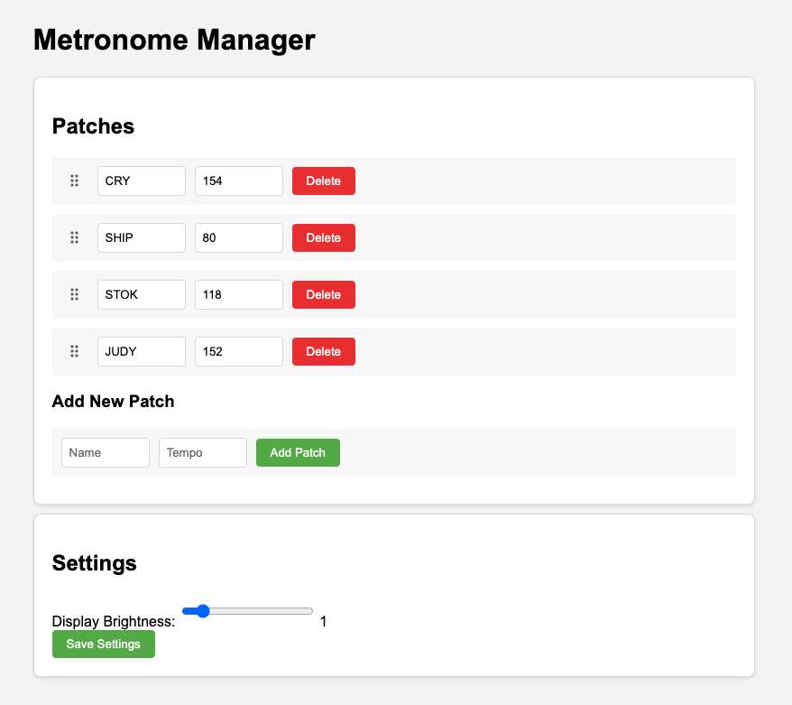

# ESP8266 Stage Metronome System

## Proof of concept video

https://youtu.be/pr7YFnc9cfY?si=y8HWWRvrHU0zolZW

## User Manual

### Overview

This professional metronome system is designed for stage use, featuring multiple operating modes, patch management, and a web interface for configuration. The system can be controlled via foot switches and includes a display for visual feedback.

### Operating Modes

#### Patch Mode

- Stores and recalls preset tempos with names
- Navigate patches using left/right buttons
- Display alternates between patch name and BPM
- Start/stop metronome with short right press (when not in Live Gig mode)

#### Free Mode

- Accessed by long-pressing left button (when not in Live Gig mode)
- Tap tempo functionality using right button
- Display shows "F" followed by current BPM
- Metronome runs continuously in this mode

#### Live Gig Mode

- Activated via hardware toggle switch
- Metronome runs continuously while active
- LED will turn off after 20 seconds of inactivity
- Long right press resets the timeout
- Cannot switch to Free mode while active
- Short right press advances to next patch
- Short left press goes to previous patch
- First decimal point indicates Live Gig mode is active

### Button Controls

#### Left Button

- Short Press (Patch Mode): Previous patch
- Long Press (not in Live Gig): Toggle between Patch/Free mode

#### Right Button

- Short Press (Patch Mode, not Live Gig): Start/stop metronome
- Short Press (Patch Mode, Live Gig): Next patch
- Short Press (Free Mode): Tap tempo
- Long Press (Patch Mode, not Live Gig): Next patch
- Long Press (Live Gig): Reset display timeout

### Web Interface

Access the web interface by connecting to the metronome's WiFi and navigating to its IP address.

#### Features

- Add new patches (4-character name, 40-240 BPM)
- Delete existing patches
- Edit patch names and tempos
- Adjust display brightness
- Changes take effect immediately

### Hardware

- Two footswitches (momentary switches)
- One toggle switch for Live Gig mode
- Four-character alphanumeric LED display
- Metronome output LED

### LED Display Indicators

- Last decimal point: WiFi connected
- First decimal point: Live Gig mode active
- Character display: Patch name or BPM

### Recovery

If the system becomes unresponsive:

1. Hold both buttons while powering up for emergency reset
2. System includes watchdog timer for auto-recovery

### Technical Specifications

- Tempo range: 40-240 BPM
- Maximum patches: 10
- Display timeout: 20 seconds (Live Gig mode)
- WiFi timeout: 30 seconds
- Input voltage: 5V via USB
